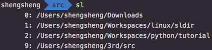

# sldir

`sldir` is a handy command line tool for unix-like systems to save and load frequently visited directories.

## Features

**1. Quick Save and Load for 0-9 Slots**:

* `s0` to `s9`: Save directories;
* `l0` to `l9`: Load directories;
* `d0` to `d9`: Delete saves;
* `sl`: Print all saved directories.

Examples:

* Save current directory to slot 1:

  ```bash
  $ s1
  ```

* Load directory saved at slot 1:

  ```bash
  $ l1
  ```

* Delete record saved at slot 1:

  ```bash
  $ d1
  ```

* Save current directory to slot 2:

  ```bash
  $ s2
  ```

* Load directory saved at slot 2:

  ```bash
  $ l2
  ```

* Delete record saved at slot 2:

  ```bash
  $ d2
  ```

* Print all saved directories:

  ```bash
  $ sl
  ```

  An example output looks like this:

  

**3. Advanced Uses by Calling `sdir`, `ldir`, `ddir` and `sldir`**:

* `sdir name`: Save current directory to the given slot `name`;
* `ldir name`: Load directory saved at `name` slot;
* `ddir name`: Delete save saved at `name` slot;
* `sldir`: Same as `sl`, print all saved dire.

Examples:

* Save current directory to slot `work`:

  ```bash
  $ sdir work
  ```

* Load directory saved at slot `work`:

  ```bash
  $ ldir work
  ```

* Delete record saved at slot `work`:

  ```bash
  $ ddir work
  ```

* Print all saved directories:

  ```bash
  $ sldir
  ```

## Installation

1. Copy and paste the following command and run it in your terminal to quickly install:

  ```bash
  git clone https://github.com/ZhouShengsheng/sldir.git /tmp/sldir && cd /tmp/sldir && sh install.sh && cd - && rm -rf /tmp/sldir
  ```

2. Restart your terminal or source ~/.bash_profile or ~/.zshrc.

## Supported Shell

* Bash
* Zsh

## License

`sldir` is released under the MIT license. See [LICENSE](LICENSE) for details.
